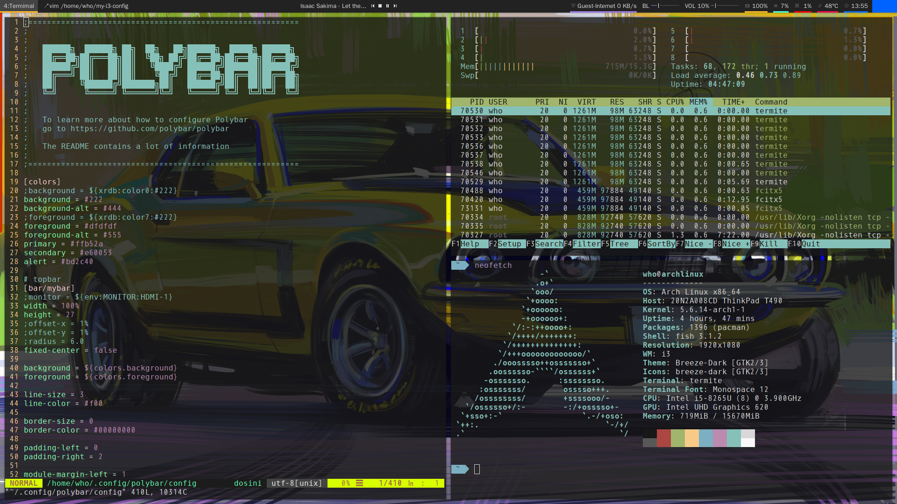

# my-i3-config
config i3wm from ZERO, this is some my config backup.

## ToDo
1. Auto lock screen after a few minutes (done)
2. Awesome Polybar

## Install
### CAUTIONS
the `install.sh` script will replace your config file with this repository.

## Important
1. NetworkManager Front-ends (nmcli-dmenu curr)
2. bar (polybar curr)
3. key binding (personal like)
4. Terminal emulator (termite curr)
5. Compositor (Picom[Compton] curr)
6. from ~/.wallpaper Random wallpaper image (feh curr)
7. from ~/.wallpaper Random lock screen image (i3lock curr)

## i3wm (gaps)
- termite, for terminal emulator (Mod+Enter)
- feh, for wallpaper (random the image file in `~/.wallpaper`)
- rofi, for app launcher (Mod+d)
- nm-applet, for network manager (optional)
- nmcli-dmenu, for network manager with dmenu (seems good)
- ranger, console file manager
- ueberzug, for ranger perview image
- thunar or dolphin, for GUI file manager
- polkit-gnome-authentication-agent-1 or polkit-kde-authentication-agent-1, for Authentication agents
- polybar
- flameshot, for screent shot
- twmn, for Desktop notifications
- xidlehook, for auto lock
- betterlockscreen (optional)

## key binding
- ctrl+Mod+0: lock, logout, suspend, hibernate, shutdown
- ctrl+Mod+l: lock screen
- Print: print full screen
- Alt+a: select a region
- Alt+f: console file manager
- Alt+e: GUI file manager
- Alt+d: dmenu
- Alt+w: google-chrome
- Alt+t: Telegram
- Alt+c: qclash
- ctrl+Mod+n: enable NSFW mode
- ctrl+Mod+s: enable SFW mode

## i3status (use polybar instead)
- Disk
- CPU Usage
- CPU-Temperature
- Memory
- Volume
- Battery
- TzTime

## personal apps
- qclash
- telegram-desktop
- fcitx5
- google-chrome

## polybar
- i3 workspace
- focused window title
- mpd
- wlan
- eth
- baklight
- volume
- mem useage
- cpu useage
- cpu temperature
- date
- power
- tray
